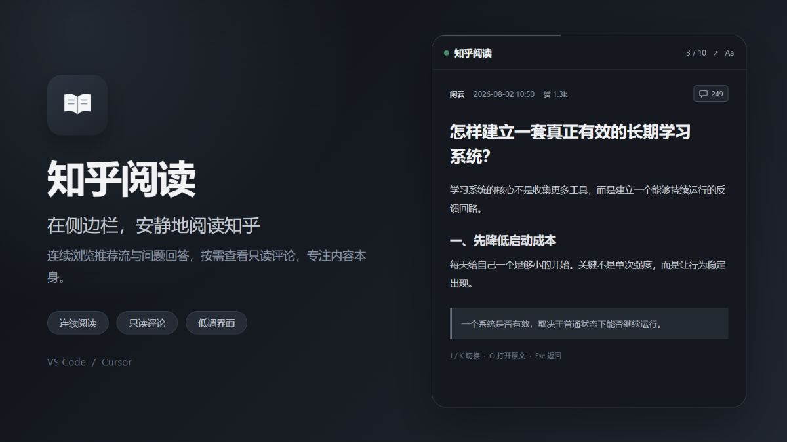

# 知乎阅读 · Zhihu Reader

[](https://github.com/ruiyou921-cloud/zhihu-reader/actions/workflows/ci.yml)
[](LICENSE)
[](https://github.com/ruiyou921-cloud/zhihu-reader/releases)



在 VS Code / Cursor 侧边栏中阅读知乎推荐流、问题回答及回答评论。界面采用类似 Agent 面板的单列布局，只读、不点赞、不发布评论，也不会在工作区生成内容文件。

> 本项目是非官方、非商业的第三方阅读工具，与知乎没有隶属、授权或合作关系。“知乎”名称及相关商标归其权利人所有。

## 安装

1. 从 [GitHub Releases](https://github.com/ruiyou921-cloud/zhihu-reader/releases) 下载最新的 `.vsix` 文件。
2. 在 VS Code / Cursor 中执行“扩展：从 VSIX 安装”。
3. 选择下载的文件并重新加载编辑器窗口。

## 使用

1. 在真实浏览器登录知乎。
2. 安装扩展后，点击活动栏中的「知乎阅读」图标。
3. 点击「导入 Cookie 并开始」，粘贴浏览器里的 Cookie 字符串。请只从浏览器 DevTools Network 面板中的知乎请求复制 `cookie` 请求头。
4. 在侧边栏连续阅读推荐内容：
   - 在正文底部继续向下滚动进入下一条；
   - 在正文顶部继续向上滚动返回上一条；
   - 触摸设备上滑/下滑可切换内容；
   - 点击视图标题栏的刷新按钮重新拉取推荐。
5. 推荐条目属于某个问题时，可点击正文下方的「查看该问题的全部回答」进入问题详情；继续滚动可逐个浏览回答，点击顶部返回箭头回到原推荐位置。
6. 顶部栏右侧的 `↗` 按钮可以在系统浏览器中打开当前知乎原文，不占用正文区域。
7. 回答元信息右侧的对话气泡图标是独立的只读评论入口；图标旁显示评论数，点击后在独立抽屉中按需读取评论，不会把评论追加到正文底部。
8. 推荐流默认过滤带有明确广告或推广标记的条目；可在设置中关闭 `zhihuReader.filterAds`。

## 阅读操作

- 到达正文顶部或底部后继续滚动，会先显示切换提示；再次滚动才会切换内容，减少触控板惯性误触。
- `J` / `N`：下一条；`K` / `P`：上一条；`R`：刷新；`O`：打开原文；`Esc`：从问题回答返回推荐流。
- 顶部栏的 `Aa` 会打开不占阅读高度的浮动显示面板；点击空白处、`×` 或按 `Esc` 即可收起。设置只保存在当前 Webview 状态中。
- 顶部低对比度灰色细线显示当前文章的阅读进度，避免形成醒目的视觉提示。
- 代码块支持复制；表格、有序列表、引用、强调和行内代码会以结构化样式呈现。

不再使用时，可以从命令面板执行「知乎：清除登录信息」，立即删除扩展保存的 Cookie 和当前阅读状态。

## 放在左侧或右侧

点击侧边栏标题栏的布局图标，会直接打开 VS Code/Cursor 原生的停靠位置选择器：

- 选择「新建辅助侧栏条目」可把知乎阅读单独放在右侧；
- 选择「新建侧栏条目」可把知乎阅读单独放回左侧；
- 也可以将其放入面板或其他视图组。

这个操作只移动「知乎阅读」，不会移动资源管理器等整个主侧栏。也可以直接拖动「知乎阅读」视图标题改变位置，IDE 会记住所选布局。

## 说明

- 正文图片不会加载；代码块、列表、引用和正文结构会保留。
- 正文内的普通链接只显示文字，不直接加载；当前条目的知乎原文通过顶部栏白名单按钮打开。
- Cookie 仅保存在 VS Code 的 `SecretStorage` 中。
- Cookie 与浏览器登录会话等价，请勿粘贴给不可信的扩展或他人；扩展只允许向 `https://www.zhihu.com/api/` 发送 Cookie。
- 请勿在 Issue、日志、截图或错误报告中提交 Cookie；一旦意外泄露，应立即退出知乎登录并撤销对应会话。
- 评论功能只发送 `GET` 请求，并将评论分页限制在回答评论的两个已知知乎 API 路径中；不包含发布、回复、点赞或删除评论的操作。
- 评论按点击加载，不预取、不写入磁盘，也不会保存为阅读历史。
- 广告过滤只依据接口返回的广告类型、布尔标记或推广载荷，不检查标题和正文关键词；没有显式标记的原生软广可能仍会显示。
- 内容直接呈现在 Webview 侧边栏，不会写入工作区。
- 扩展抓取内容时仍会直连 `zhihu.com`，网络网关可能记录访问流量。
- 知乎接口并非公开稳定 API，未来可能因接口或风控变化而需要调整。
- 使用者应遵守知乎服务条款、所在地法律法规以及合理的访问频率限制；本项目不提供绕过验证码、风控或访问控制的能力。

安全问题请不要公开披露，处理方式见 [SECURITY.md](SECURITY.md)。参与开发前请阅读 [CONTRIBUTING.md](CONTRIBUTING.md)。

## 开发

```bash
npm ci
npm run compile   # 或 npm run watch
npm run check     # 测试、类型检查并生成单文件扩展入口
```

在 VS Code 中按 F5 启动扩展宿主调试，或执行：

```bash
npx @vscode/vsce package
```

生成 `.vsix` 后，可通过 VS Code / Cursor 的「从 VSIX 安装」安装。
